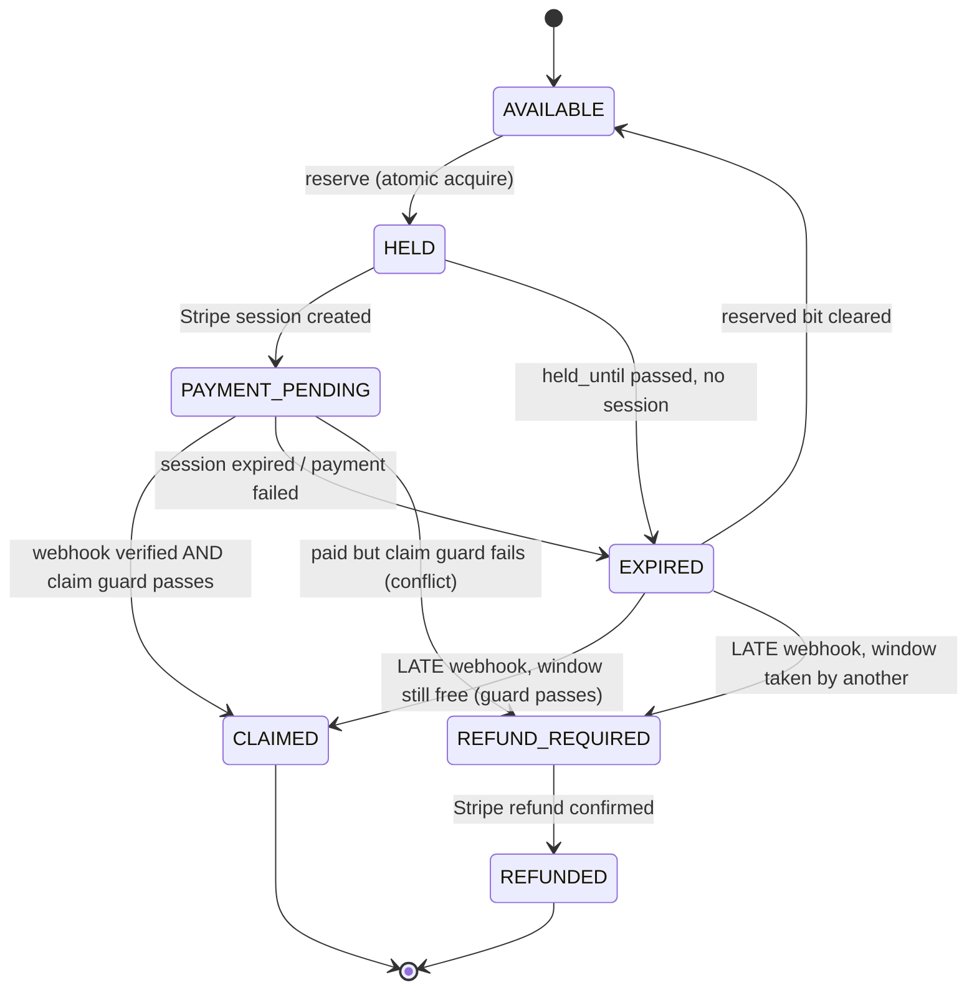
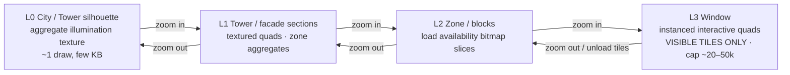
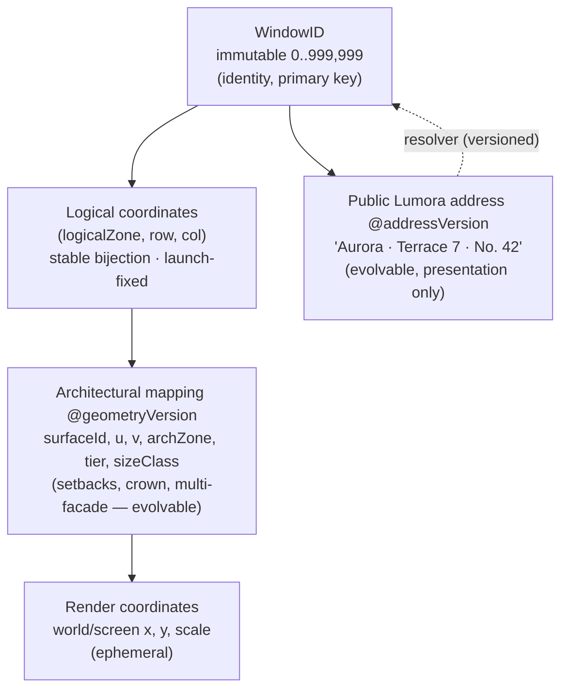
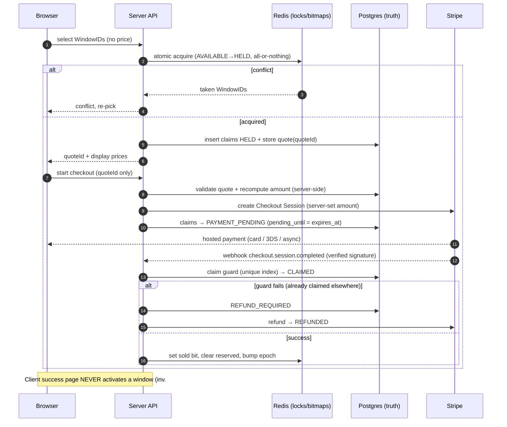
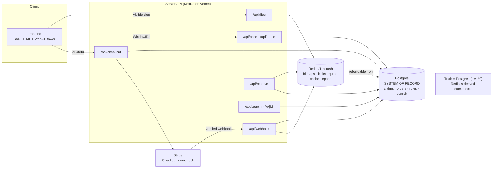

# Lumora Tower — Canonical Architecture

> **Status:** approved architecture direction; pre-implementation.
> **Product:** Lumora Tower — a digital tower with **exactly 1,000,000** claimable windows.
> **Legacy name:** "PLOTS" (terminology only; do not reintroduce).
> **This document is the single source of truth for architecture.** Code must conform to it. Where code and this document disagree, this document wins until it is explicitly revised.

---

## 0. Scope & non-goals

**In scope:** rendering, coordinate/ID model, data architecture, reservation/payment state machine, pricing, performance, search/navigation, migration, repository structure, phased delivery.

**Explicit non-goals (for this document):** the exact commercial pricing curve; final visual/geometry design of the tower; final public-address wording. The architecture must *support* all of these evolving without breaking the invariants below.

---

## 1. Invariants (MUST hold at all times)

These are non-negotiable. Every design decision below serves them.

1. **There are exactly 1,000,000 claimable `WindowID`s**, numbered `0 … 999,999`.
2. **`WindowID` is immutable after launch.** Its value and its meaning never change.
3. **The `WindowID → logical-coordinate` bijection is fixed at launch** and never changes.
4. **An AVAILABLE window requires no database row.** Absence of an ownership/claim record *is* availability.
5. **A `WindowID` has at most one `CLAIMED` owner.** Enforced by a Postgres unique constraint, never by a TTL.
6. **The browser cannot determine the authoritative price.** Price is computed and validated server-side only.
7. **The browser cannot activate a window.** Only a verified Stripe webhook, processed server-side, can move a window to `CLAIMED`.
8. **A Stripe webhook alone cannot bypass ownership/conflict validation.** A valid payment event still must pass the server-side claim guard; if it cannot claim, it becomes `REFUND_REQUIRED`.
9. **Redis is never the sole permanent source of ownership truth.** Postgres is the system of record; Redis is a rebuildable hot cache/lock layer.
10. **Visual geometry may evolve without changing any `WindowID`.** The architectural mapping is versioned.
11. **The public Lumora address may evolve without changing any `WindowID`.** The address namespace is versioned and is never a primary key.
12. **The final checkout amount is always determined and validated server-side** at session-creation time, bound to a server-stored quote and to a live reservation.

---

## 2. The four-layer model (Decisions 1 & 2)

The core idea: **separate identity from geometry from presentation.** A `WindowID` is a stable ticket number. How it looks, where it sits on the building, and how humans name it are all *downstream, versioned* concerns.

```
   ┌────────────────────────────────────────────────────────────────────┐
   │ 1. WindowID            immutable integer 0..999,999  (identity)     │  ← primary key everywhere
   └───────────────┬────────────────────────────────────────────────────┘
                   │  stable bijection, fixed at launch (invariant #3)
   ┌───────────────▼────────────────────────────────────────────────────┐
   │ 2. Logical coordinates  (logicalZone, logicalRow, logicalCol)       │  ← data/tiling/pricing space
   │    An ABSTRACT, launch-fixed decomposition of the ID space.         │
   │    NOT the building shape. Used for tiles, range queries, zones.    │
   └───────────────┬────────────────────────────────────────────────────┘
                   │  archMap@geometryVersion  (VERSIONED, may evolve — invariant #10)
   ┌───────────────▼────────────────────────────────────────────────────┐
   │ 3. Architectural mapping                                            │  ← how it sits on the building
   │    WindowID → { surfaceId, u, v, archZone, tier, sizeClass }        │
   │    Supports setbacks, crown, varying widths, MULTIPLE facades.      │
   └───────────────┬────────────────────────────────────────────────────┘
                   │  renderer + camera + LOD (ephemeral)
   ┌───────────────▼────────────────────────────────────────────────────┐
   │ 4. Render coordinates   world/screen (x, y, scale)                  │  ← pure view, never stored
   └────────────────────────────────────────────────────────────────────┘

   Independent, versioned presentation namespace (invariant #11):
   WindowID  ⇄  Public Lumora address @addressVersion   (e.g. "Aurora · Terrace 7 · No. 42")
```

### 2.1 Layer definitions

| Layer | What it is | Mutability | Used for |
|---|---|---|---|
| **WindowID** | Opaque integer `0..999,999` | **Immutable** (inv. #2) | Primary key in DB, Redis bits, URLs, payments, metadata |
| **Logical coordinates** | `(logicalZone, logicalRow, logicalCol)` — an abstract, launch-fixed partition of the ID space | **Fixed at launch** (inv. #3) | Tiling, region/availability queries, pricing zones, aggregates |
| **Architectural mapping** | `archMap@v(WindowID) → { surfaceId, u, v, archZone, tier, sizeClass }` | **Versioned** (inv. #10) | Placing windows on the tower geometry (setbacks/crown/multi-facade) |
| **Render coordinates** | `(x, y, scale)` in world/screen space | Ephemeral | Drawing only; recomputed per frame |
| **Public Lumora address** | `addr@v(WindowID) → human string` + pretty URL | **Versioned** (inv. #11) | Display, sharing, pretty links; resolves back to WindowID |

### 2.2 Why logical coordinates are abstract (not the building shape)

If tiling/pricing were bound to the *visual* 1000×1000 rectangle, any change to the silhouette (adding a crown, a setback, a second facade) would churn tile boundaries, pricing zones, and cached availability. Instead:

- **Logical coordinates** are a stable, dense enumeration used purely by the *data* layer. Tiles and availability bitmaps are defined here, so they never move.
- **Architectural mapping** is the *only* place that knows the building looks like. It can be re-authored (`geometryVersion` bump) to reshape the tower while every `WindowID` keeps its identity, ownership, price history, and URL.

> Canonical decomposition at launch (illustrative, to be finalized in Phase 1):
> `logicalRow = WindowID div COLS`, `logicalCol = WindowID mod COLS`, with `COLS` fixed at launch, and `logicalZone` derived from banded ranges. This is a *data* grid, deliberately decoupled from how many facades or setbacks the rendered tower has.

### 2.3 Address abstraction (Decision 2)

- The **public Lumora address** is a presentation layer produced by a **versioned resolver** `addr@v`. It can change wording/structure over time (`addressVersion` bump) without touching `WindowID`.
- **Canonical machine link:** `/w/{WindowID}` (always valid, never changes).
- **Pretty/shareable link:** e.g. `/tower/aurora/terrace-7/42`, resolved to a `WindowID` via the resolver; old pretty links 301-redirect after an address-version change.
- The public address is **never** a foreign key or storage key. All joins use `WindowID`.

---

## 3. Data architecture (Decision aligned with invariants #4, #5, #9)

**Two stores, clear roles:**

- **Postgres = system of record (truth).** Durable ownership, orders, claims, pricing rules, search, moderation, analytics. Every €-bearing fact lives here.
- **Redis (Upstash) = hot, rebuildable cache/lock layer.** Availability bitmaps, reservation locks, quote cache, aggregates, live-update fan-out. Can be fully rebuilt from Postgres.

### 3.1 What is stored per CLAIMED window

Postgres `claims` (source of truth):

| column | notes |
|---|---|
| `window_id` | integer, the identity |
| `state` | enum: `HELD` \| `PAYMENT_PENDING` \| `CLAIMED` \| `REFUND_REQUIRED` \| `REFUNDED` (see §5) |
| `order_id` | FK to `orders` |
| `owner_name` / `business_name` | |
| `url`, `color`, `mark` (icon/emoji), `tagline` | window content (inv. #5 metadata) |
| `lang` | for i18n |
| `price_paid_cents` | server-computed amount actually charged |
| `legacy_id` | e.g. `"12-9"` for migrated windows (§8) |
| `moderation_status` | for future moderation |
| `owner_token_hash` | for future owner self-service edits |
| `held_until` / `pending_until` | expiry timestamps (not a Redis TTL) |
| `created_at`, `claimed_at`, `updated_at` | |

**Unique guard (invariant #5):**
```sql
CREATE UNIQUE INDEX one_active_claim_per_window
  ON claims (window_id)
  WHERE state IN ('HELD','PAYMENT_PENDING','CLAIMED');
```
This — not a TTL — is what makes double-selling impossible.

### 3.2 What is NOT stored for AVAILABLE windows (invariant #4)

Nothing. An AVAILABLE window has **no row** in `claims`, and its bit is `0` in the Redis `sold`/`reserved` bitmaps. Availability is the default; the system only ever records exceptions (holds and claims). This keeps storage proportional to *sold* windows, not to 1,000,000.

### 3.3 Availability by visible region (the core read path)

The client requests availability only for **visible logical tiles**:

```
GET /api/tiles?ids=t1,t2,…      → per tile: { soldSlice, reservedSlice, aggregate }
```

- **Redis bitmaps:** `sold` and `reserved` are bit arrays over the 1,000,000 logical indices → **125 KB each, total.** A single tile’s slice is a few hundred bytes (`GETRANGE`/`BITFIELD`). The client determines availability of thousands of windows **without any per-window record**.
- **Aggregates for far LOD:** per-zone counts (`agg:zone:*`) and a small "sold heatmap" texture (e.g. 256×256) derived from the bitmap and cached — this is the L0/L1 illumination summary.
- **Reserved slice source of truth:** Redis `reserved` is a fast hint; the authoritative pending/held state is the Postgres `claims` rows (§5). A reconciler keeps Redis in sync with Postgres and can rebuild it entirely.

### 3.4 Caching & live updates

- Tile slices: short edge-TTL + a global monotonic **`epoch`** counter bumped on every sale/hold change; clients cheaply check `epoch` (or subscribe via **SSE** scoped to visible tiles) and refetch changed tiles only.
- Metadata of CLAIMED windows: long cache; invalidated on edit/moderation.
- Everything Redis holds is derivable from Postgres (invariant #9).

---

## 4. Rendering & LOD

- **Renderer:** **WebGL via Three.js** — `OrthographicCamera` (with a subtle perspective tilt for the cinematic far view) and **`InstancedMesh`** for windows. We never instance 1,000,000; LOD guarantees only visible tiles are instanced (cap ~20–50k instances, one draw call).
- **SEO/content pages remain normal SSR HTML** (invariant-friendly for indexing); only the interactive tower uses WebGL.
- **LOD levels (slippy-map style):**

| Level | Rendered | Data pulled |
|---|---|---|
| **L0 City** | tower silhouette + aggregate illumination texture | one small heatmap summary |
| **L1 Tower** | facade sections as textured quads | zone aggregates |
| **L2 Zone** | blocks/zones | availability bitmap slices for visible blocks |
| **L3 Window** | individual **interactive** instanced quads, **visible tiles only** | availability slices + metadata of the few CLAIMED windows in view |

  Off-screen tiles are unloaded. Detailed interactive elements exist only at L3 and only for currently visible tiles.

- **Picking (click detection):** the grid is regular in **logical space**, so the window under the cursor is computed **analytically** — screen → camera inverse → render coords → architectural inverse → logical coords → `WindowID` — in O(1), no GPU readback. Result is validated against the loaded tile’s data.
- **Camera model:** state `{zoom, centerX, centerY}`; discrete `zoom → LOD` thresholds; smooth `fly-to` via tweening; pan clamped so the tower/city stays framed and canvas edges never show.

---

## 5. Reservation / payment state machine (Decision 3)

**We do not rely on a 600-second Redis TTL for correctness.** TTLs are convenience/hints; correctness comes from the Postgres unique index (§3.1) plus explicit states persisted in Postgres.

### 5.1 States

| State | Meaning | Where recorded |
|---|---|---|
| `AVAILABLE` | Default; claimable | *No row* (inv. #4) |
| `HELD` | User selected & reservation acquired, before Stripe session | `claims` row `HELD`, `held_until`; Redis `reserved` bit + lock |
| `PAYMENT_PENDING` | Stripe Checkout session created, awaiting payment/webhook (incl. 3DS/async) | `claims` row `PAYMENT_PENDING`, `pending_until = session.expires_at` |
| `CLAIMED` | Payment verified server-side; ownership written | `claims` row `CLAIMED` (permanent); Redis `sold` bit set, `reserved` cleared |
| `EXPIRED` | Hold/pending lapsed with no successful payment | row removed or `EXPIRED`; Redis `reserved` cleared → effectively `AVAILABLE` |
| `REFUND_REQUIRED` | Paid, but cannot be claimed (conflict / claimed-elsewhere / moderation) | `claims`/`orders` row `REFUND_REQUIRED` |
| `REFUNDED` | Refund completed | terminal |

### 5.2 Transition rules



### 5.3 Acquire is atomic (no double-sell)

- **Reserve:** a single Lua script (or a Postgres transaction using the unique index) attempts to move all selected windows `AVAILABLE → HELD` all-or-nothing. Any window already `HELD/PAYMENT_PENDING/CLAIMED` → the whole reservation fails with the conflicting `WindowID`s returned.
- **Claim (webhook):** `UPDATE claims SET state='CLAIMED' … WHERE window_id=? AND state IN ('PAYMENT_PENDING','HELD','EXPIRED') AND NOT EXISTS (another CLAIMED)`. The unique partial index guarantees only one `CLAIMED` can exist per window.

### 5.4 Edge cases — handled without double-selling

- **Late Stripe webhook (after hold/pending expired):** payment is authoritative, but the *claim guard* runs. If the window is still free → `EXPIRED/AVAILABLE → CLAIMED`. If another owner is already `CLAIMED` → `REFUND_REQUIRED → REFUNDED`. Expiry never loses a paid order; the unique index arbitrates.
- **3DS / delayed / async payment:** `PAYMENT_PENDING` is persisted in Postgres with `pending_until = session.expires_at` (minutes to hours, configurable). Redis `reserved` bit lifetime is extended to match; the reconciler keeps them aligned. Stripe `checkout.session.async_payment_succeeded/failed` are handled in addition to `checkout.session.completed`.
- **Expired reservation, no payment:** a sweeper (and lazy-on-read checks) transitions `HELD/PAYMENT_PENDING → EXPIRED` past expiry and clears the `reserved` bit → window becomes `AVAILABLE`.
- **Conflict at reserve time:** atomic acquire returns the taken `WindowID`s; the client re-picks.
- **Webhook retries / duplicates:** idempotent by `order_id` (`CLAIMED` → no-op) plus a processed-`event.id` set.
- **Moderation rejection after claim:** allowed only via an explicit admin path → `REFUND_REQUIRED` (never a silent state change).

---

## 6. Pricing (Decision 4 — server-stored `quoteId`, not HMAC)

**Chosen: server-stored `quoteId`.** The browser receives an opaque `quoteId` only; it never sees or influences the amount.

**Why `quoteId` over a signed HMAC blob:**
- We already keep server state (reservations, orders), so a stored quote is a natural extension, not new infrastructure.
- A stored quote is **bound to a live reservation and session**: it can be single-use, revocable, and reconciled with the state machine — an HMAC blob cannot easily be revoked or tied to "these exact windows are still HELD by you."
- Full **auditability** (what price/rule-version was offered, when, to whom) for €-bearing decisions.
- No replay-within-expiry risk and no secret-rotation fragility.

**Flow:**
1. Client sends selected `WindowID`s (never a price).
2. Server computes `price(WindowID) = base × zoneMult × heightMult × visibilityMult × scarcityMult`, clamped **≥ €9** (min), using a **versioned pricing-rules table** (Postgres). Target realized average **€42.20** is achieved by tuning these multipliers and monitored via analytics — no fixed price anywhere.
3. Server reserves the windows (`→ HELD`) and stores a **quote**: `{ quoteId, windowIds, perIdCents, totalCents, ruleVersion, createdAt, expiresAt, status }`. Returns `quoteId` + display prices.
4. At checkout, server loads the quote by `quoteId`, verifies it is unexpired, single-use, still bound to windows the same session holds, **recomputes/validates** the amount, and sets the Stripe amount server-side (invariant #12).
5. `POST /api/price?ids=…` gives per-window prices for hover/selection display; these are display-only and re-validated at quote time.

**Manipulation protection:** all amounts server-computed and server-set on the Stripe session; the client holds only an opaque id.

---

## 7. Checkout / Stripe (unchanged flow, extended)

- **Stripe remains the provider.** Keep Checkout Sessions + webhook signature verification + `automatic_tax` + `tax_code: 'txcd_10000000'` + `apiVersion: '2025-03-31.basil'` (Managed Payments requirements).
- **Webhook is the sole activator** (invariant #7); it must still pass the claim guard (invariant #8).
- Idempotency keys on session creation; processed-event dedupe; auto-refund on residual conflict (`REFUND_REQUIRED → REFUNDED`).

---

## 8. Migration from the 600-window prototype

- **Keep untouched initially:** the Stripe session+webhook shape, webhook-only activation, the Redis order pattern, `automatic_tax`/`tax_code`/`apiVersion`, and the current `/api/state` + `/api/checkout` until replacements reach parity behind feature flags.
- **Legacy IDs:** current `${r}-${c}` (30×20) map to reserved `WindowID`s (a "Founders" logical band) via an explicit table; migrated `claims` carry `legacy_id`; old links 301-redirect. Production has ~1 sold window → migration is a small, reviewable script.
- **Sequence:** (1) coordinate/`WindowID` module + pricing service behind the 600 model; (2) Postgres as truth + mirror sold windows + backfill Redis bitmaps; (3) tiled API + reservations behind a flag; (4) WebGL renderer on `/tower-beta` reading the tiled API, parity at 600; (5) migrate legacy window(s) + redirects, full paid E2E on beta; (6) scale grid config 600 → 1,000,000, mobile perf test; (7) cut over `/`, keep fallback; (8) SSR window pages, search, i18n, SSE, moderation, analytics, upgrades.

---

## 9. Search / direct navigation

- **Search owner/business:** Postgres full-text index on `owner_name`/`business_name`/`tagline`/`url` → `GET /api/search?q=` → `WindowID`s → `fly-to`.
- **Direct link `/w/{WindowID}`:** SSR HTML page (SEO, og-image, public metadata) + "view in tower" deep-link with camera `fly-to`. Every CLAIMED window becomes an indexable URL.
- **Sharing:** canonical `/w/{id}` + pretty address URL (resolver-backed).

---

## 10. Performance

- **Max rendered objects:** L0 ≈ 1 draw; L1 ≤ hundreds; L2 ≤ thousands; L3 ≤ ~20–50k instances (one `InstancedMesh`). Never 1,000,000.
- **Network:** page load ships **no window data** — only the shell + a few-KB heatmap. Zoom-driven, region-scoped fetches thereafter (a 50×50 tile slice ≈ ~313 bytes). Live updates via SSE on visible tiles.
- **Mobile/consumer HW:** instanced WebGL is GPU-cheap; cap instances; smaller prefetch radius on mobile; emoji/mark texture atlas; DPR-aware; unload off-screen tiles; Canvas2D summary fallback where WebGL is unavailable.
- **Expected bottlenecks:** availability freshness under concurrency (→ bitmaps + `epoch` + SSE); metadata volume at scale (→ lazy + Postgres indexes); reservation contention on premium zones (→ atomic acquire); texture memory on mobile (→ cap + stream).

---

## 11. Diagrams

### A. City → Tower → Zone → Window (LOD flow)



### B. WindowID → architectural mapping → public address



### C. Reservation → Stripe → webhook → CLAIMED



### D. Data flow (Frontend / Redis / Postgres / Stripe)



---

## 12. Repository structure (target)

```
lumora-tower/
  app/                                   # Next.js App Router — SEO HTML is SSR
    (marketing)/…                        # how-it-works, pricing, faq, about, contact
    tower/page.tsx                       # shell that mounts the WebGL renderer
    w/[id]/page.tsx                      # SSR window detail (SEO, og-image, deep link)
    api/
      tiles/route.ts                     # availability slices by logical tile
      price/route.ts                     # per-WindowID display price
      quote/route.ts                     # create/validate server-stored quote (quoteId)
      reserve/route.ts                   # atomic acquire / release
      checkout/route.ts                  # Stripe session (server-set amount)
      webhook/route.ts                   # Stripe webhook — sole activator
      search/route.ts
      window/[id]/route.ts               # public metadata
  src/
    coords/                              # WindowID ⇄ logical ⇄ architectural ⇄ address; tiles
    renderer/                            # Camera, Lod, TileManager, WindowInstances, Picking, FlyTo
    pricing/                             # versioned rules, price(id), quote lifecycle
    store/                               # redis: bitmaps, reservations, quote cache, epoch
    db/                                  # postgres: schema, claims, orders, search
    payments/                            # stripe: session, webhook verify, refunds, idempotency
    domain/                              # window states, types, invariants (as code guards)
    i18n/
  public/                                # textures/atlases, static assets
  scripts/                               # migrate-legacy-ids, backfill-bitmap, reconcile
  tests/                                 # coords, pricing, reservation, contract (headless/jsdom)
  config/                                # grid size, geometryVersion, addressVersion, pricing rules, flags
  LUMORA_ARCHITECTURE.md                 # this document
```

---

## 13. Implementation phases (small, testable, deployable)

| Phase | Deliverable | Risk |
|---|---|---|
| **P0** | Rebrand strings PLOTS → Lumora Tower | none (isolated) |
| **P1** | `coords/` — WindowID ⇄ logical ⇄ architectural(v) ⇄ address(v) + tests | none (no behavior change) |
| **P2** | Server pricing + server-stored `quoteId`; checkout uses server amount (still 600) | low |
| **P3** | Postgres as truth; mirror sold windows; backfill Redis bitmaps | low |
| **P4** | Tiled availability API + reservation state machine (flagged) + contract tests | medium |
| **P5** | WebGL renderer on `/tower-beta` (LOD, instancing, analytic picking, camera); parity at 600 | medium |
| **P6** | Migrate legacy window(s) + redirects; paid E2E on beta; scale config → 1,000,000; mobile perf | medium |
| **P7** | Cut over `/`; keep fallback | medium |
| **P8+** | SSR window pages + og-image, search, i18n, SSE live updates, moderation, analytics, premium upgrades | incremental |

---

## 14. Summary decisions

1. **Recommended stack:** Next.js (App Router) on Vercel · **Three.js** (Orthographic + `InstancedMesh`, slippy-map LOD, analytic picking) · **Redis/Upstash** (availability bitmaps + atomic reservations + quote cache + epoch) · **Postgres** (system of record + search/moderation/analytics) · **Stripe Checkout + webhook** (flow unchanged, sole activator) · **server-stored `quoteId`** pricing.
2. **Biggest technical risk:** availability consistency + double-sell prevention under high concurrency in a serverless/edge environment — mitigated by the Postgres unique index (truth), atomic acquire, and the explicit state machine (not TTLs). Secondary: mobile GPU/memory under LOD.
3. **First implementation phase:** **P1 (+ optional P0)** — the `coords/` identity/mapping/address module with tests, because every later layer (tiles, pricing, URLs, migration, renderer) depends on a stable `WindowID` and the four-layer separation, and it carries zero production risk.
4. **Untouched initially:** `webhook.js` (signature verification + server-side activation), the Redis order pattern, `automatic_tax`/`tax_code`/`apiVersion:'2025-03-31.basil'`, and the current `/api/state` + `/api/checkout` — until their replacements reach parity behind feature flags.

---

## 15. Final canonical additions (ratified)

These four decisions are ratified and binding. They reinforce and make explicit the guarantees already implied by §1–§6; where any future design detail conflicts with them, these win.

### 15.1 Geometry versioning
Visual tower geometry may evolve through a **`geometryVersion`** — setbacks, crown sections, widths, additional facade surfaces, or a full remapping of where a window sits. **A `WindowID` must never change as a result of a redesign or remapping.** A `geometryVersion` bump re-authors only the *architectural mapping* (layer 3); the `WindowID` (layer 1) and the `WindowID → logical-coordinate` bijection (layer 2) are immutable. Reshaping the building never migrates identity, ownership, price history, or URLs. *(Reinforces invariants #2, #3, #10.)*

### 15.2 Quote immutability
Once a **`quoteId`** is created, its **selected `WindowID`s, `ruleVersion`, calculated per-window and total amounts, and expiration are immutable**. A quote is never edited in place. **Changing the selection creates a new `quoteId`** (and the prior quote's held windows are released or superseded). Checkout binds to exactly one immutable `quoteId`; the server still recomputes/validates against it at session creation (invariant #12). *(Reinforces §6.)*

### 15.3 Ownership persistence ordering
For `CLAIMED` ownership, **Postgres is the durable source of truth.** Redis bitmaps/caches are **derived projections** and must be fully **rebuildable from Postgres**. The claim is committed to Postgres first (passing the unique-index guard); the Redis `sold`/`reserved` bits and aggregates are updated after, as a projection. **A Redis write must never be the only durable proof of ownership** — if Redis is lost, ownership is reconstructed from Postgres with no loss. *(Reinforces invariants #5, #9.)*

### 15.4 Public address is not identity
Lumora public-facing addresses may be **renamed, localized, or reformatted** over time via `addressVersion`. **Ownership, payments, deep links, and all internal references resolve through the immutable `WindowID`**, never through the public address. The public address is a versioned presentation/resolver layer only and is never a key, a foreign key, or a payment/ownership reference. Old public address forms 301-redirect to the current form, but the underlying `WindowID` is unchanged. *(Reinforces invariants #2, #11.)*
